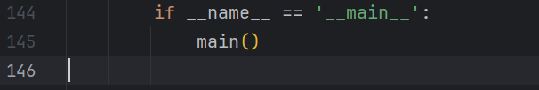
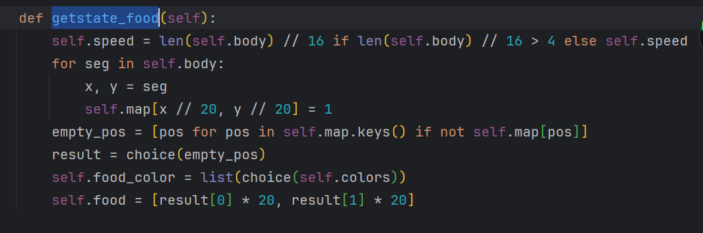
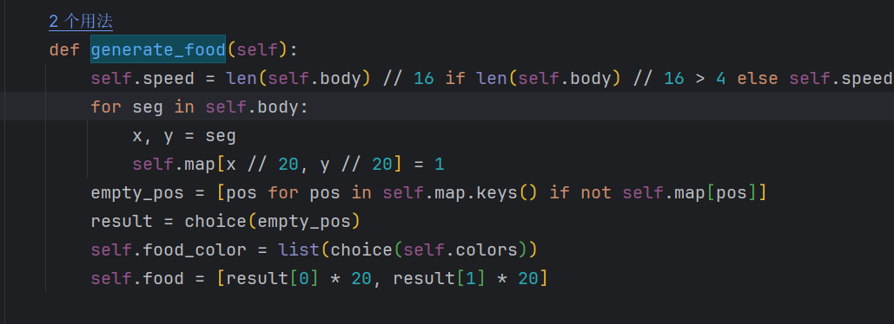
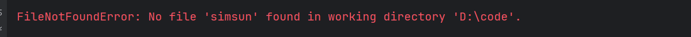
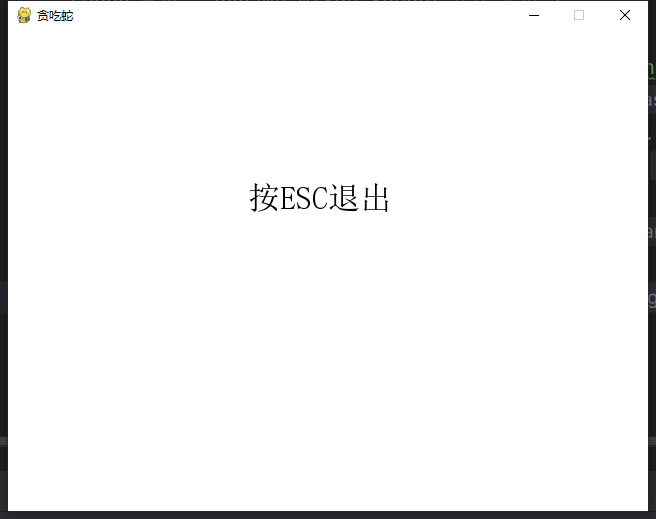
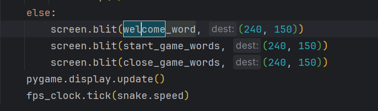
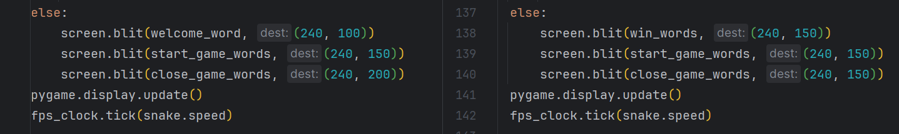

>前言：今天中午朋友问我一个贪吃蛇的代码问题，正常运行但是无法出现游戏窗口

先看了下源代码
```python
import pygame
from os import path
from sys import exit
from time import sleep
from random import choice
from itertools import product
from pygame.locals import QUIT, KEYDOWN


# 检查方向
def direction_check(moving_direction, change_direction):
    directions = [['up', 'down'], ['left', 'right']]
    if moving_direction in directions[0] and change_direction in directions[1]:
        return change_direction
    elif moving_direction in directions[1] and change_direction in directions[0]:
        return change_direction
    return moving_direction


class Snake:
    colors = list(product([0, 64, 128, 192, 255], repeat=3))[1:-1]

    def __init__(self):
        self.map = {(x, y): 0 for x in range(32) for y in range(24)}
        self.body = [[100, 100], [120, 100], [140, 100]]
        self.head = [140, 100]
        self.food = []
        self.food_color = []
        self.moving_direction = 'right'
        self.speed = 4
        self.generate_food()
        self.game_started = False

    def check_game_status(self):
        if self.body.count(self.head) > 1:
            return True
        if self.head[0] < 0 or self.head[0] > 620 or self.head[1] < 0 or self.head[1] > 460:
            return True
        return False

    def move_head(self):
        moves = {
            'right': (20, 0),
            'up': (0, -20),
            'down': (0, 20),
            'left': (-20, 0),
        }
        step = moves[self.moving_direction]
        self.head[0] += step[0]
        self.head[1] += step[1]

    def getstate_food(self):
        self.speed = len(self.body) // 16 if len(self.body) // 16 > 4 else self.speed
        for seg in self.body:
            x, y = seg
            self.map[x // 20, y // 20] = 1
        empty_pos = [pos for pos in self.map.keys() if not self.map[pos]]
        result = choice(empty_pos)
        self.food_color = list(choice(self.colors))
        self.food = [result[0] * 20, result[1] * 20]


def main():
    key_direction_dict = {
        119: 'up',
        115: 'down',
        97: 'left',
        100: 'right',
        273: 'up',
        274: 'down',
        276: 'left',
        275: 'right',
    }


    fps_clock = pygame.time.Clock()
    pygame.init()
    pygame.mixer.init()
    snake = Snake()
    sound = False
    if path.exists('eat.wav'):
        sound_wav = pygame.mixer.Sound("eat.wav")
        sound = True
    title_font = pygame.font.Font('simsun', 32)
    welcome_word = title_font.render('贪吃蛇', True, (0, 0, 0), (255, 255, 255))
    tips_font = pygame.font.Font('simsum', 20)
    start_game_words = ('点击开始', True, (0, 0, 0), (255, 255, 255))
    close_game_words = ('按ESC退出', True, (0, 0, 0), (255, 255, 255))
    game_over_words = ('游戏结束', True, (205, 92, 92), (255, 255, 255))
    win_words = ('蛇很长了，你赢了！', True, (0, 0, 205), (255, 255, 255))
    screen = pygame.display.set_mode((640, 480), 0, 32)
    pygame.display.set_caption('贪吃蛇')
    new_direction = snake.moving_direction

    while 1:
        for event in pygame.event.get():
            if event.type == QUIT:
                exit()
            elif event.type == KEYDOWN:
                if event.key == 27:
                    exit()
                if snake.game_started and event.key in key_direction_dict:
                    direction = key_direction_dict[event.key]
                    new_direction = direction_check(
                        snake.moving_direction, direction
                    )
            elif (not snake.game_started) and event.type == pygame.MOUSEBUTTONDOWN:
                x, y = pygame.mouse.get_pos()
                if 213 <= x <= 422 and 304 <= y <= 342:
                    snake.game_started = True
        screen.fill((255, 255, 255))
        if snake.game_started:
            snake.moving_direction = new_direction
            snake.move_head()
            snake.body.append(snake.head[:])
            if snake.head == snake.food:
                if sound:
                    sound_wav.play()
                snake.generate_food()
            else:
                snake.body.pop(0)
            for seg in snake.body:
                pygame.draw.rect(screen, [0, 0, 0], [seg[0], seg[1], 20, 20])
            pygame.draw.rect(screen, snake.fps_clock, [snake.food[0], snake.food_color[1], 20, 20], 0)
            if snake.check_game_status():
                screen.blit(game_over_words, (241, 310))
                pygame.display.update()
                snake = Snake()
                new_direction = snake.moving_direction
                sleep(3)
            elif len(snake.body) == 512:
                screen.blit(win_words, (33, 210))
                pygame.display.update()
                snake = Snake()
                new_direction = snake.moving_direction
                sleep(3)
        else:
            screen.blit(win_words, (240, 150))
            screen.blit(start_game_words, (240, 150))
            screen.blit(close_game_words, (240, 150))
        pygame.display.update()
        fps_clock.tick(snake.speed)

        if __name__ == '__main__':
            main()
```
太长不看，先丢给chatgpt4帮我阅读，然后再一步步修改
先是发现了这个调用主函数写在了上面的while(1)循环里
   

更正后发现报错变成了这个
```python 
AttributeError: 'snake' object has no attribute 'generate_food'. Did you mean:
'getstate_food'?
```
很明显，代码里面有错别字  
`getrate_food`和`getstate_food`只有一个是对的  

更改后

剩下一个字体的问题了

把字体导入同一目录下即可  


发现可以成功启动游戏，但是只有一个标题
  
更改下标题的位置即可
